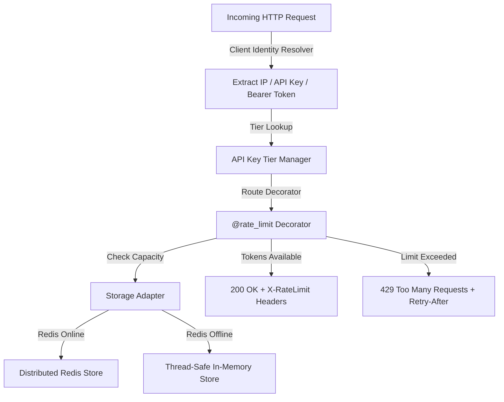

# 🛡️ Week 32 — API Rate Limiter Middleware

A high-performance, production-grade **API Rate Limiter Middleware** built with Python Flask. Implements both **Token Bucket** and **Sliding Window Log** algorithms, thread-safe memory storage, distributed Redis adapters with automatic in-memory fallback, subscription tier management (`Free`, `Pro`, `Enterprise`), standard HTTP rate-limiting headers (`X-RateLimit-*`), and an interactive web control center with live request burst testing.

---

## 🏗️ System Architecture



---

## ✨ Key Features

- **Dual Algorithm Engines**:
  - **Token Bucket Algorithm**: Continuous microsecond token refills supporting temporary traffic bursts while maintaining a steady consumption rate.
  - **Sliding Window Log Algorithm**: Rolling timestamp log array with microsecond accuracy, preventing double-capacity boundary exploitation.
- **API Key Subscription Tiers**:
  - **Free Tier**: 5 requests / 60 seconds
  - **Pro Tier**: 30 requests / 60 seconds
  - **Enterprise Tier**: 100 requests / 60 seconds
- **Resilient Storage Architecture**: Distributed Redis storage adapter with automatic, transparent fallback to thread-safe local memory.
- **Standard HTTP Rate Limit Headers**:
  - `X-RateLimit-Limit`: Total allowed capacity.
  - `X-RateLimit-Remaining`: Tokens remaining in current window.
  - `X-RateLimit-Reset`: Unix timestamp when capacity fully resets.
  - `Retry-After`: Returned on HTTP 429 errors indicating seconds until retry.
- **Interactive Web Control Center**: Real-time burst request tester (1x, 5x, 10x), visual token bucket capacity meter gauge, live analytics scorecard, and custom sandbox testing panel.

---

## 🔌 REST API Reference Table

| Method | Endpoint | Description | Rate Limit |
| :--- | :--- | :--- | :--- |
| `GET` | `/api/health` | Service health status check | Unlimited |
| `POST` | `/api/auth/api-key` | Issue new developer API key by tier (`free`, `pro`, `enterprise`) | Unlimited |
| `GET` | `/api/auth/api-key/status` | Inspect active API key tier and capacity | Unlimited |
| `GET` | `/api/public/ping` | Public endpoint test | 10 reqs / 60 sec |
| `GET` | `/api/data/burst-test` | Token Bucket algorithm burst test endpoint | 5 reqs / 10 sec |
| `GET` | `/api/sliding/test` | Sliding Window Log algorithm test endpoint | 5 reqs / 10 sec |
| `POST` | `/api/action/heavy` | Strict action rate limit test | 2 reqs / 30 sec |
| `GET` | `/api/tier/data` | Dynamic tier-based rate limit endpoint | Resolved by API Key Tier |
| `GET` | `/api/custom/test` | Custom sandbox limit test endpoint | Dynamic (`custom_limit`, `custom_window`) |

---

## ⚡ Quick Start Guide

### 1. Run Backend Flask Server
```bash
cd week32_rate_limiter/backend
python run.py
```
The backend API server will start on `http://127.0.0.1:5000`.

### 2. Run Automated Pytest Suite
```bash
cd week32_rate_limiter/backend
python -m pytest tests/ -v
```

### 3. Open Control Center Dashboard
Open `week32_rate_limiter/frontend/public/index.html` in any web browser to test real-time bursts, capacity meters, and algorithm toggles!

---

## 🧪 Pytest Suite Status

- **Total Tests**: `11/11` passing
- **Coverage**: Token Bucket, Sliding Window Log, IP & API Key Identity Resolution, Dynamic Tier Rate Limits, Custom Sandbox Overrides, Multi-Proxy Header Chains, HTTP 429 Status Codes, and Retry-After Headers.
