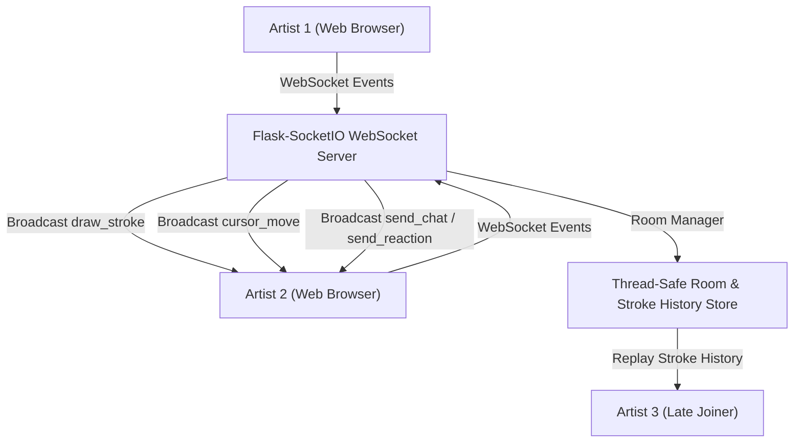

# 🎨 Week 33 — Multi-User Drawing Canvas

A high-performance, real-time collaborative **Multi-User Drawing Canvas** web application built with HTML5 Canvas 2D API, WebSockets (Flask-SocketIO), and ES6 modular JavaScript. Allows multiple users to create or join shared drawing rooms via unique 6-character room codes, sketch together simultaneously with smooth quadratic curve brush strokes, select drawing tools (Brush, Eraser, Line, Rectangle, Circle), view live floating peer cursors, manage an Undo/Redo history stack, chat in real-time, send animated floating emoji reactions, and export finished artwork as high-resolution PNG images.

---

## 🏗️ System Architecture



---

## ✨ Key Features

- **HTML5 Canvas 2D Core Engine**:
  - **High-DPI Retina Scaling**: Uses `window.devicePixelRatio` scaling so drawings stay ultra-sharp across all screens and monitors.
  - **Smooth Quadratic Curves**: Connects brush coordinates using `ctx.quadraticCurveTo` interpolation for fluid freehand brush strokes.
  - **True Pixel Eraser**: Uses native pixel transparency (`destination-out`) so erased strokes work cleanly across both Dark and Light themes.
  - **Window Resize Protection**: Automatically preserves and redraws all accumulated canvas strokes upon browser window resize.
- **Geometric Shape Drawing Tools**:
  - Straight Line Tool (📏)
  - Rectangle Tool (🔲)
  - Circle / Ellipse Tool (⭕)
  - Live drag-preview snapshot overlay cleaning up intermediate drag frames.
- **Real-Time Collaboration (WebSockets)**:
  - **Instant Stroke Broadcast**: Live drawing stroke sync across all room participants.
  - **Late-Joiner Stroke Replay**: Automatically replays accumulated room stroke history for artists joining mid-session.
  - **Floating Remote Peer Cursors**: Renders floating SVG/CSS cursor badges showing peer nicknames and assigned avatar colors in real-time.
  - **Participant Sidebar**: Displays active room artists and online color indicators.
- **Social Engagement & Tools**:
  - **In-Room Collapsible Text Chat**: Real-time text messaging between artists inside the drawing workspace.
  - **Floating Reaction Emojis (❤️, 🎉, 🔥, 👏, 💡)**: Animated floating emoji badges that float upward across the shared canvas screen when clicked.
  - **Undo / Redo History Stack**: Up to 30 steps of canvas state undo/redo memory with keyboard shortcuts (`Ctrl+Z` / `Ctrl+Y`).
  - **Export Artwork as PNG**: 1-click high-resolution image downloader (`CanvasSync_ART-123.png`).

---

## 🔌 REST API & WebSocket Reference Table

### REST API Endpoints
| Method | Endpoint | Description | Status Code |
| :--- | :--- | :--- | :--- |
| `GET` | `/api/health` | Service health status check | `200 OK` |
| `POST` | `/api/rooms` | Generate new room code (`CANVAS-XXXXX`) | `201 Created` |
| `GET` | `/api/rooms/<code_id>` | Inspect room status, user count, and stroke count | `200 OK` / `404 Not Found` |

### WebSocket Event Protocol
| Direction | Event Name | Payload Data | Description |
| :--- | :--- | :--- | :--- |
| Client -> Server | `join_room` | `{ room_code, username }` | Join socket room & request state |
| Server -> Client | `room_joined` | `{ room_code, user, users_list, strokes_history }` | Return room state & stroke history |
| Server -> Room | `user_joined` | `{ user, users_list }` | Notify room peers of new user |
| Client -> Server | `draw_stroke` | `{ room_code, stroke }` | Emit stroke drawn locally |
| Server -> Room | `stroke_received` | `{ tool, color, size, points }` | Broadcast stroke to room peers |
| Client -> Server | `cursor_move` | `{ room_code, username, color, x, y }` | Emit cursor position (30fps) |
| Server -> Room | `cursor_update` | `{ sid, username, color, x, y }` | Broadcast remote cursor position |
| Client -> Server | `send_chat` | `{ room_code, username, message }` | Emit in-room text chat |
| Server -> Room | `chat_received` | `{ sid, username, message }` | Broadcast text chat message |
| Client -> Server | `send_reaction` | `{ room_code, username, emoji }` | Emit floating emoji reaction |
| Server -> Room | `reaction_received` | `{ sid, username, emoji }` | Broadcast floating emoji reaction |
| Client -> Server | `clear_canvas` | `{ room_code }` | Request clear room canvas |
| Server -> Room | `canvas_cleared` | `{ room_code }` | Broadcast canvas clear command |

---

## ⚡ Quick Start Guide

### 1. Run Backend WebSocket Server
```bash
cd week33_drawing_canvas/backend
python run.py
```
The backend WebSocket server starts on `http://127.0.0.1:5000`.

### 2. Run Automated Pytest Suite
```bash
cd week33_drawing_canvas/backend
python -m pytest tests/ -v
```

### 3. Open Canvas Workspace in Browser
Open `week33_drawing_canvas/frontend/public/index.html` in your web browser. Create a room or type a room code, open a second browser window with the same room code, and sketch together in real-time!

---

## 🧪 Pytest Suite Status

- **Total Tests**: `6/6` passing
- **Coverage**: Health check endpoints, room creation REST API, random room code generation, 404 nonexistent room error handling, and thread-safe RoomManager state management.
