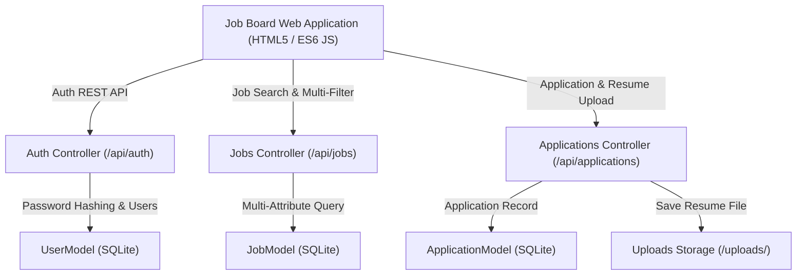

# 💼 Week 34 — Job Board Platform

A production-grade, full-stack **Job Board Platform** built with Flask (Python), SQLite, and modular ES6 JavaScript. Enables employers to publish tech job opportunities, inspect received candidate submissions, download uploaded resume files (`.pdf` / `.docx`), and update candidate review statuses (`Pending`, `Reviewing`, `Interviewing`, `Accepted`, `Rejected`). Enables job seekers to search job listings with live keyword matching and multi-attribute filters (Location, Job Type, Category, Minimum Salary), submit applications with resume uploads, track their application statuses in real-time, and bookmark favorite job listings.

---

## 🏗️ System Architecture



---

## ✨ Key Features

- **Multi-Attribute Job Search Engine**:
  - Live keyword matching across position title, company name, and job descriptions.
  - Multi-filtering by location (Remote, NYC, SF), commitment type (Full-time, Remote, Contract, Part-time), job category (Engineering, Data Science, Frontend), and minimum annual salary threshold ($80k+, $120k+, $150k+).
- **Multipart Resume File Upload & Storage**:
  - Candidates apply with contact info, cover letter notes, and binary resume document uploads (`.pdf`, `.docx`, `.doc`, `.txt`).
  - Uploaded files are validated, sanitized, stored securely in `backend/uploads/`, and accessible for employer evaluation.
- **Employer Recruitment Portal**:
  - Real-time recruitment metrics dashboard tracking active listings, total applications, and pending reviews.
  - Interactive job publishing modal and job listing deletion.
  - Candidate review list with direct resume download links and live status dropdown selectors (`Pending` ⏳, `Reviewing` 🔍, `Interviewing` 🎯, `Accepted` ✅, `Rejected` ❌).
- **Job Seeker Applicant Dashboard**:
  - Live application status tracking displaying target company info, applied date, submitted resume link, and current review stage.
  - Bookmarked saved jobs catalog grid with 1-click apply and un-bookmark actions.
- **Role-Based Authentication**:
  - Sign in and account registration supporting interactive role switching between Job Seekers and Employers.

---

## 🔌 REST API Reference Table

| Method | Endpoint | Description | Status Code |
| :--- | :--- | :--- | :--- |
| `GET` | `/api/health` | Service health status check | `200 OK` |
| `POST` | `/api/auth/register` | Register new user account (`applicant` or `employer`) | `201 Created` / `409 Conflict` |
| `POST` | `/api/auth/login` | Authenticate user credentials and return user profile | `200 OK` / `401 Unauthorized` |
| `GET` | `/api/jobs` | Query job listings with keyword, location, type, category, and salary filters | `200 OK` |
| `GET` | `/api/jobs/<id>` | Fetch single job listing overview and requirements | `200 OK` / `404 Not Found` |
| `POST` | `/api/jobs` | Create new job posting (Employer only) | `201 Created` / `400 Bad Request` |
| `PUT` | `/api/jobs/<id>` | Update existing job listing | `200 OK` / `404 Not Found` |
| `DELETE` | `/api/jobs/<id>` | Delete job listing and associated applications | `200 OK` / `404 Not Found` |
| `POST` | `/api/applications` | Submit job application with multipart resume file upload | `201 Created` / `400 Bad Request` |
| `GET` | `/api/jobs/<id>/applications` | Fetch candidate applications submitted for a job posting | `200 OK` |
| `PUT` | `/api/applications/<id>/status` | Update candidate application review status | `200 OK` / `400 Bad Request` |
| `GET` | `/api/users/<id>/applications` | Fetch application submission history for an applicant | `200 OK` |
| `GET` | `/api/users/<id>/saved-jobs` | Fetch bookmarked jobs list for a user | `200 OK` |
| `POST` | `/api/users/<id>/saved-jobs` | Toggle bookmark status for a job listing | `200 OK` / `400 Bad Request` |
| `GET` | `/uploads/<filename>` | Download candidate resume document file | `200 OK` / `404 Not Found` |

---

## ⚡ Quick Start Guide

### 1. Run Backend Server & Seed Database
```bash
cd week34_job_board/backend
python run.py
```
The Flask server seeds initial tech job listings and starts on `http://127.0.0.1:5000`.

### 2. Run Automated Pytest Test Suite
```bash
cd week34_job_board/backend
python -m pytest tests/ -v
```

### 3. Open Job Board Web Application
Open `week34_job_board/frontend/public/index.html` in your web browser to browse tech jobs, filter listings, submit applications with resume uploads, and access employer or applicant dashboards!

---

## 🧪 Pytest Suite Status

- **Total Tests**: `43/43` passing across 5 test modules (`test_auth_api.py`, `test_job_api.py`, `test_application_api.py`, `test_bookmark_api.py`, `test_security_edge_cases.py`, `test_job_board.py`).
- **Coverage**: Registration, login, password hashing, role switching, multi-filter searching, job CRUD, multipart resume file uploads, status pipeline transitions, bookmark toggles, SQL injection resilience, and path traversal protection.
