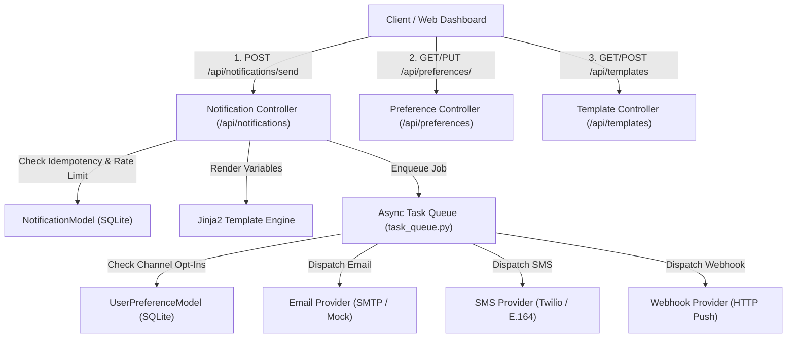

# 🔔 Week 35 — Multi-Channel Notification System & Web Dashboard

A production-grade, high-throughput **Multi-Channel Notification System** built with Flask (Python), SQLite, Jinja2, an asynchronous `ThreadPoolExecutor` background task queue, and an interactive ES6 JavaScript frontend dashboard. Dispatches personalized notifications across **Email** (SMTP / Mock Email), **SMS** (Twilio / E.164 phone formatting), and **Webhook** (HTTP POST event pushes). Features Jinja2 dynamic template variable rendering, user channel opt-in/opt-out preference enforcement, idempotency key deduplication, per-user rate limiting, exponential backoff retries, and comprehensive delivery audit logs.

---

## 🏗️ System Architecture



---

## ✨ Key Features

- **Multi-Channel Dispatcher Engine**:
  - **Email**: Supports HTML/Text email formatting, custom subject headers, and RFC email format validation.
  - **SMS**: Supports international phone number validation (E.164 format e.g. `+14155552671`) and text length checks.
  - **Webhook**: Dispatches structured JSON notification payloads via HTTP/HTTPS POST requests.
- **Asynchronous Background Task Queue & Worker Pipeline**:
  - Thread-safe background Queue & `ThreadPoolExecutor` worker pool.
  - API responses return `HTTP 202 Accepted` immediately without blocking on external provider network calls.
  - Automatic exponential backoff retries (`0.4s`, `0.8s`, `1.6s`) for transient network failure recovery.
- **Dynamic Jinja2 Template Engine**:
  - Reusable notification templates with variable placeholders (e.g. `{{ username }}`, `{{ job_title }}`).
  - Dynamic subject and body text rendering with automatic fallback.
- **Idempotency Deduplication Engine**:
  - Upstream clients can supply an `idempotency_key`.
  - Re-submitted requests instantly return previously generated audit records (`HTTP 200 OK`) without re-queuing duplicate messages.
- **User Channel Preference Guard**:
  - Centralized user opt-in / opt-out controls for Email, SMS, and Webhook channels.
  - Background workers automatically skip delivery (`status = 'Skipped'`) if the recipient opted out of that channel.
- **Per-User Rate Limiting**:
  - Enforces a 10 request/minute rate limit per user (`Config.RATE_LIMIT_PER_MINUTE = 10`) to prevent abuse and runaway loops.
- **Interactive Web Dashboard**:
  - Modern, responsive Dark / Light mode UI for dispatching notifications, selecting templates with auto-populated JSON variables, toggling user channel preferences in real-time, and monitoring the live auto-polling audit feed.

---

## 🔌 REST API Reference Table

| Method | Endpoint | Description | Status Code |
| :--- | :--- | :--- | :--- |
| `GET` | `/api/health` | Service health status check | `200 OK` |
| `POST` | `/api/notifications/send` | Enqueue notification with template rendering, idempotency check, and rate limiting | `202 Accepted` / `200 OK` / `429 Too Many Requests` |
| `GET` | `/api/notifications/<id>` | Fetch real-time delivery status, attempt counts, and error logs | `200 OK` / `404 Not Found` |
| `GET` | `/api/users/<id>/notifications` | Fetch notification dispatch history for a specific user | `200 OK` |
| `GET` | `/api/preferences/<user_id>` | Fetch user channel opt-in/opt-out preferences | `200 OK` |
| `PUT` | `/api/preferences/<user_id>` | Update user channel opt-in/opt-out preferences | `200 OK` |
| `GET` | `/api/templates` | List all registered notification templates | `200 OK` |
| `GET` | `/api/templates/<name>` | Fetch single template details by name | `200 OK` / `404 Not Found` |
| `POST` | `/api/templates` | Register new notification template (`email`, `sms`, `webhook`) | `201 Created` / `400 Bad Request` / `409 Conflict` |

---

## ⚡ Quick Start Guide

### 1. Run Backend Server & Seed Database
```bash
cd week35_notification_system/backend
python run.py
```
The Flask server seeds default notification templates and starts on `http://127.0.0.1:5000`.

### 2. Open Frontend Web Dashboard
Open the file in your web browser:
```
week35_notification_system/frontend/public/index.html
```

### 3. Run Automated Pytest Test Suite
```bash
cd week35_notification_system/backend
python -m pytest tests/ -v
```

### 4. Send a Sample Notification via cURL
```bash
curl -X POST http://127.0.0.1:5000/api/notifications/send \
  -H "Content-Type: application/json" \
  -d '{
    "user_id": 1,
    "recipient": "vee@dev.io",
    "channel": "email",
    "template_name": "welcome_email",
    "variables": { "username": "Vee", "email": "vee@dev.io" },
    "idempotency_key": "sample_key_101"
  }'
```

---

## 🧪 Pytest Suite Status

- **Total Tests**: `114/114` passing across 8 specialized test modules.
- **Coverage**: Email/SMS/Webhook providers, Jinja2 template rendering, async task queue execution, user opt-out skipping, exponential backoff retries, idempotency key reuse, rate limiting counters, SQL injection resilience, and REST API controllers.
